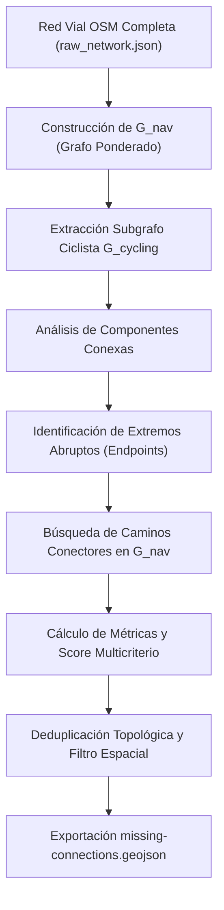

# Metodología: Detector Algorítmico de Conexiones Faltantes (Fase 3)

CicloConecta implementa un motor determinista basado en teoría de grafos para identificar **brechas estructurales** (*gaps*) en la infraestructura ciclista urbana.

El objetivo central es responder de forma cuantitativa y transparente a la pregunta:
> **¿Dónde una conexión relativamente pequeña podría mejorar significativamente la continuidad de la red ciclista existente?**

---

## 1. Principios del Algoritmo

1. **No inventa infraestructura ni conexiones fantasma**: Las conexiones candidatas se calculan **estrictamente sobre la red vial real** extraída de OpenStreetMap ($G_{\text{nav}}$). Nunca se trazan líneas rectas a través de edificios, vías férreas sin cruce o ríos sin puentes.
2. **Sin Inteligencia Artificial generativa**: El cálculo de brechas, rutas y puntuaciones es **100% determinista** mediante algoritmos de grafos (componentes conexas en NetworkX y camino mínimo ponderado).
3. **Diferenciación estricta entre vías ciclistas y calles ciclables**:
   - $G_{\text{cycling}}$ (red ciclista dedicada): incluye exclusivamente vías con infraestructura segregada o carril ciclista explícito (`highway=cycleway`, vías peatonales con `bicycle=designated`, o calles con `cycleway=lane|track`).
   - $G_{\text{nav}}$ (red navegable urbana): incluye la malla vial completa donde está permitido circular (residenciales, terciarias, secundarias, etc.).
4. **Terminología prudente y responsable**: Los resultados se presentan como *"Conexiones potenciales"*, *"Oportunidades detectadas"* o *"Candidatos algorítmicos"*. Nunca se catalogan como proyectos aprobados ni proyectos de ingeniería vial final.

---

## 2. Etapas del Pipeline de Detección

### Etapa 1: Extracción del Subgrafo Ciclista ($G_{\text{cycling}}$)
A partir del grafo navegable $G_{\text{nav}}$, se filtran únicamente las aristas que cuentan con atributos ciclistas formales (`is_cycleway: true`).

En Curicó:
- Nodos ciclistas: **757**
- Aristas ciclistas: **1.644**
- Extensión total: **42,22 km**

### Etapa 2: Análisis de Componentes Conexas
Se descompone $G_{\text{cycling}}$ en subgrafos conexos independientes $C_1, C_2, \dots, C_k$, ordenados por longitud descendente.

En Curicó:
- **31 componentes conexas** detectadas.
- **Componente Principal (#01)**: 19,12 km (espina dorsal urbana que cruza el centro de norte a sur y poniente).
- **Componente Secundaria (#02)**: 4,38 km (sector nororiente: El Boldo / Zapallar).
- 24 componentes intermedias ($\ge 200\text{ m}$).
- 5 fragmentos aislados menores ($< 200\text{ m}$).

### Etapa 3: Identificación de Extremos Abruptos (Endpoints)
Para cada componente sustancial ($\ge 200\text{ m}$), se identifican los nodos de grado 1 ($\text{deg}(v) = 1$) en $G_{\text{cycling}}$ donde la ciclovía termina repentinamente sin empalme.

En Curicó se identificaron **74 extremos relevantes**.

### Etapa 4: Búsqueda de Caminos Conectores en $G_{\text{nav}}$
Para cada par de extremos $(u, v)$ pertenecientes a componentes distintas ($C_a \neq C_b$):
1. **Filtro de proximidad euclidiana**: $35\text{ m} \le d_{\text{crow}}(u, v) \le 850\text{ m}$.
2. **Cálculo de camino vial real**: Se calcula el camino mínimo en $G_{\text{nav}}$ ponderado por estrés vehicular.
3. **Filtro de longitud máxima de brecha**: $L_{\text{gap}} \le 1.200\text{ m}$.

### Etapa 5: Conexiones de Extremo a Borde (Side Connections)
Para evitar omitir extremos que quedan cerca del centro o cuerpo de una ciclovía mayor (y no necesariamente de sus puntas), se analiza la proyección hacia nodos intermedios de componentes grandes a menos de 500 m en línea recta y 750 m de recorrido vial.

---

## 3. Función de Puntuación de Prioridad (Priority Score)

El índice de prioridad asigna una puntuación transparente de **0 a 100 puntos** combinando tres criterios:

$$\text{Priority Score} = S_{\text{network}} + S_{\text{efficiency}} + S_{\text{comfort}}$$

### 1. Impacto de Red ($S_{\text{network}} \in [0, 50]$ pts)
Premia unir redes extensas en lugar de tramos insignificantes. Utiliza la raíz cuadrada de la componente menor para dar peso progresivo a la consolidación de redes secundarias:

$$S_{\text{network}} = \min\left(50,\, 19.5 \cdot \sqrt{L_{\min}} + 12.0 \cdot \log_{10}(1 + L_{\text{total}})\right)$$

Donde $L_{\min}$ es la longitud de la componente menor (en km) y $L_{\text{total}} = L_a + L_b$.

### 2. Eficiencia y Compacidad de la Brecha ($S_{\text{efficiency}} \in [0, 35]$ pts)
Premia intervenciones cortas y directas que requieren mínima obra civil:

$$S_{\text{efficiency}} = \max\left(0,\, 35.0 \cdot \left(1 - \frac{L_{\text{gap}}}{1.200}\right)\right)$$

Brechas menores a 100 m obtienen más de 32 puntos; brechas de 500 m obtienen ~20 puntos; brechas de 1.200 m obtienen 0 puntos.

### 3. Confort y Seguridad Vial del Corredor ($S_{\text{comfort}} \in [0, 15]$ pts)
Evalúa la tipología vial del tramo intermedio. Vías locales y residenciales (bajo estrés vehicular) puntúan más alto que avenidas primarias o secundarias con alto tráfico motorizado:

$$S_{\text{comfort}} = \min\left(15.0,\, 15.0 \cdot \frac{\max(0.3,\, 1.8 - 0.5 \cdot \bar{P})}{1.3}\right)$$

Donde $\bar{P}$ es la penalización promedio de las calles intermedias ($\sim 1.0$ para residenciales, $\sim 2.5$ para arterias mayores).

---

## 4. Deduplicación y Filtro Espacial

1. **Agrupación por par de componentes**: Entre cualquier par de componentes $(C_a, C_b)$, se retiene únicamente la conexión con mayor puntuación.
2. **Eliminación de solapamiento espacial**: Si dos candidatos comparten más del 60% de sus nodos o calles viales, se descarta el de menor puntaje para no sugerir corredores paralelos redundantes.

---

## 5. Resultados en Curicó (Top 10 Oportunidades)

| Rank | Nombre de la Oportunidad | Brecha ($L_{\text{gap}}$) | Red Unificada | Ganancia | Score | Corredor Vial |
| :---: | :--- | :---: | :---: | :---: | :---: | :--- |
| **#01** | **Manuel Antonio Caro** | 75 m | 19,62 km | 258,3x | **75.9** | Manuel Antonio Caro, Pehuén, Pescara |
| **#02** | **Enrique Lafourcade** | 834 m | 24,33 km | 28,2x | **75.4** | Enrique Lafourcade, Ñirre, Pescara |
| **#03** | **Avenida Manso de Velasco** | 308 m | 20,44 km | 65,4x | **72.1** | Av. Manso de Velasco, Argomedo |
| **#04** | **Camino Zapallar** | 369 m | 20,49 km | 54,2x | **71.1** | Camino Zapallar, Ángel Lago |
| **#05** | **Circunvalación Paul Harris** | 139 m | 19,74 km | 139,4x | **70.2** | Circunvalación Paul Harris |
| **#06** | **Merced** | 446 m | 19,63 km | 43,0x | **67.6** | Merced, Membrillar |
| **#07** | **Avenida Dr. Osorio** | 563 m | 20,44 km | 35,4x | **67.1** | Av. Doctor Osorio |
| **#08** | **Calle sin nombre (El Boldo)** | 557 m | 5,20 km | 8,3x | **58.7** | Calle local El Boldo |
| **#09** | **Avenida Trapiche** | 711 m | 19,74 km | 26,8x | **58.1** | Avenida Trapiche |
| **#10** | **Pasaje 3 / Circunvalación** | 682 m | 19,74 km | 27,9x | **56.6** | Pasaje 3, Circunvalación |

### Hallazgos Clave en Curicó
1. **Oportunidad #01 (Manuel Antonio Caro)**: Con solo **75 metros** en una calle residencial calma se conecta una ciclovía aislada de 420 m al gran sistema central de 19,12 km, con una ganancia de red de **258 veces la longitud de la brecha**.
2. **Oportunidad #02 (Enrique Lafourcade)**: Corredor de **834 metros** que logra el mayor impacto territorial de Curicó: une la red central (#1, 19,12 km) con la red nororiente de Zapallar/El Boldo (#2, 4,38 km), conformando una **red continua unificada de 24,33 km**.
